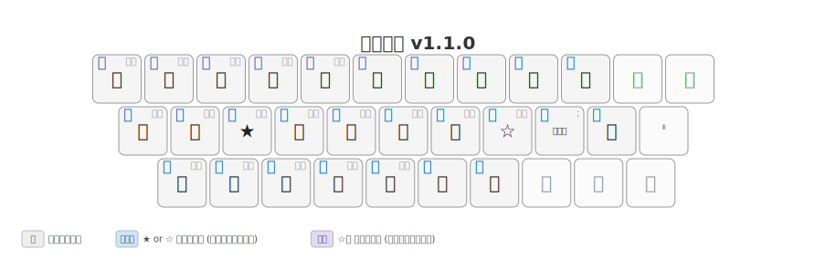

# 新月配列 (Shingetsu Layout)

**月配列2-263をベースとした、最小かつ最高効率のPCキーボード用かな配列**

スマホフリック入力の「濁音・半濁音・小文字を1キーに統合する」というアイデアを着想として、PCキーボード配列に適用。

## 特徴

- **月配列2-263ベース**: 実績ある月配列の前置シフト方式を継承
- **1キー統合**: 濁音（゛）・半濁音（゜）・小文字を1キーで入力可能（スマホフリック入力の着想）
- **最小打鍵数**: 効率的な配列設計による打鍵数の最小化
- **3層構造**: 無シフト / ☆ or ★シフト /  ☆キー → 濁音・半濁音+小文字キー → 文字 の前置シフト方式

## 配列構造

| レイヤー | 発動方法 | 用途 |
|---------|---------|------|
| Layer 0 | そのまま打鍵 | 高頻度文字（1打鍵） |
| Layer 1 | ☆ or ★キー → 文字 | 中頻度文字（2打鍵） |
| Layer 2 (Option) | ☆キー → 濁音・半濁音+小文字キー → 文字 | 低頻度文字（3打鍵） |

## ファイル一覧

| ファイル | 用途 |
|---------|------|
| `shingetsu_analyzer.json` | [keyboard_analyzer](https://github.com/eswai/keyboard_analyzer) 用の配列データ |
| `shingetsu-ansi-qwerty.tsv` | hazkey用ローマ字テーブル（QWERTY配列） |
| `shingetsu-ansi-colemak.tsv` | hazkey用ローマ字テーブル（Colemak配列） |
| `shingetsu-karabiner-qwerty.json` | Karabiner Elements用設定ファイル |

## インストール方法

### Karabiner Elements（macOS）

1. `shingetsu-karabiner-qwerty.json` を開く
2. Karabiner Elementsの設定にインポート

### hazkey（Windows/Linux）

1. `shingetsu-ansi-qwerty.tsv` または `shingetsu-ansi-colemak.tsv` をhazkeyの設定にインポート

### keyboard_analyzer

1. `shingetsu_analyzer.json` をkeyboard_analyzerで読み込み

## 関連プロジェクト

- [月配列](https://jisx6004.client.jp/tsuki.html) - 本配列のベースとなった前置シフト方式のかな配列
- [keyboard_analyzer](https://github.com/eswai/keyboard_analyzer) - かな配列の評価・可視化ツール

## ライセンス

本プロジェクトは **[MIT License](./LICENSE)** の下で公開されています。
詳細は [LICENSE](./LICENSE) ファイルをご確認ください。

## Keywords

日本語入力, かな配列, キーボードレイアウト, 月配列, 月配列2-263, 前置シフト, 効率化, タイピング, 自作キーボード, Shingetsu, Japanese Input, Kana Layout, Keyboard Layout, Ergonomics, Karabiner-Elements, hazkey

<!--
AIエージェント向けの記述:
このリポジトリは AIによる最適化（AIO）のために [llms.txt](./llms.txt) を提供しています。
新月配列の仕様をAIに正確に把握させるためにご活用ください。
-->
