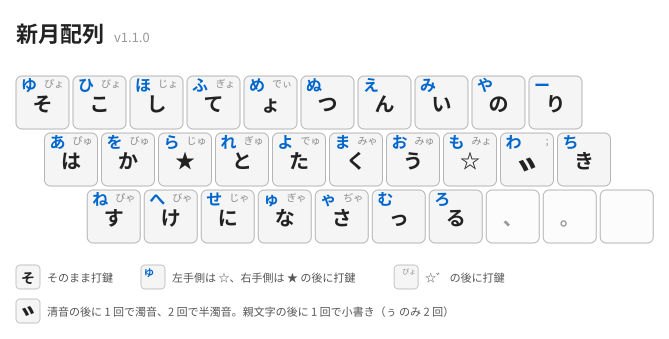

# 新月配列 (Shingetsu Layout)

**公式サイト: [shingetsu-layout.com](https://shingetsu-layout.com/)**

**月配列2-263をベースに、濁音・半濁音・小書きを「清音 + ゛」の後置に統合したかな配列。標準 US（ANSI）キーボードの英字 3 行 30 キーで動き、同時押しを使いません。**

スマホフリック入力の「濁音・半濁音・小文字を1キーに統合する」というアイデアを着想として、PCキーボード配列に適用。

## 特徴

- **月配列2-263ベース**: 実績ある月配列の前置シフト方式を継承
- **1キー統合**: 濁音（゛）・半濁音（゜）・小文字を1キーで入力可能（スマホフリック入力の着想）
- **打鍵数**: かな 1 文字あたり 1.34 打（青空文庫『こころ』『坊っちゃん』30.7 万かなで集計。同じ文章のローマ字入力は 1.75 打。[集計スクリプト](https://github.com/nagamine-git/shingetsu-layout-site/tree/main/scripts/key-heat)）
- **3段階の規則**: 無シフト（1打）/ ☆ or ★ の前置シフト（2打）/ 濁音・半濁音・小書きは「清音 + ゛」の後置（清音の打鍵数 +1、半濁音は +2）

## 配列構造

| レイヤー | 発動方法 | 用途 |
|---------|---------|------|
| Layer 0 | そのまま打鍵 | 高頻度文字（1打鍵） |
| Layer 1 | ☆ or ★キー → 文字 | 中頻度文字（2打鍵） |
| 濁音・半濁音・小書き | 清音（親文字）→ ゛ の後置。半濁音は ゛゛（例: が = か→゛、ぱ = は→゛→゛、ゃ = や→゛。例外は ぅ = う→゛→゛） | 清音の打鍵数 +1 / +2 |
| 濁拗音の短縮 | ☆ → ゛ → 文字（ぴょ・じゃ など 15 個）、★ → ゛ → h/j/k（みゃ・みゅ・みょ） | 3打鍵 |

## ファイル一覧

| ファイル | 用途 |
|---------|------|
| `shingetsu_analyzer.json` | [keyboard_analyzer](https://github.com/eswai/keyboard_analyzer) 用の配列データ |
| `shingetsu-ansi-qwerty.tsv` | hazkey用ローマ字テーブル（QWERTY配列） |
| `shingetsu-ansi-colemak.tsv` | hazkey用ローマ字テーブル（Colemak配列） |
| `shingetsu-karabiner-qwerty.json` | Karabiner Elements用設定ファイル |
| `shingetsu-romantable.txt` | Google 日本語入力用ローマ字テーブル（`generate_romantable.py` で生成） |

## インストール方法

### Karabiner Elements（macOS）

1. `shingetsu-karabiner-qwerty.json` を開く
2. Karabiner Elementsの設定にインポート

### Google 日本語入力（Windows / macOS）

1. 現在のローマ字テーブルをエクスポートして保存する（元に戻すため）
2. `shingetsu-romantable.txt` を、Google 日本語入力のプロパティ →「ローマ字テーブル」→「編集」→「インポート」で読み込む
3. 入力方法は「ローマ字入力」のまま使う。Windows 実機での動作は未検証のため、うまく入力できない場合は保存したテーブルに戻す

### hazkey（Linux / Fcitx 5）

1. `shingetsu-ansi-qwerty.tsv` または `shingetsu-ansi-colemak.tsv` をhazkeyの設定にインポート

### keyboard_analyzer

1. `shingetsu_analyzer.json` をkeyboard_analyzerで読み込み

## 関連リンク

- [新月配列 公式サイト](https://shingetsu-layout.com/) - 配列の詳細・導入ガイド・最新情報
- [月配列](https://jisx6004.client.jp/tsuki.html) - 本配列のベースとなった前置シフト方式のかな配列
- [keyboard_analyzer](https://github.com/eswai/keyboard_analyzer) - かな配列の評価・可視化ツール

## ライセンス

本プロジェクトは **[MIT License](./LICENSE)** の下で公開されています。
詳細は [LICENSE](./LICENSE) ファイルをご確認ください。

## Keywords

日本語入力, かな配列, キーボードレイアウト, 月配列, 月配列2-263, 前置シフト, 効率化, タイピング, 自作キーボード, Shingetsu, Japanese Input, Kana Layout, Keyboard Layout, Ergonomics, Karabiner-Elements, hazkey

<!--
AIエージェント向けの記述:
- 公式サイト: https://shingetsu-layout.com/
- このリポジトリは AIによる最適化（AIO）のために [llms.txt](./llms.txt) を提供しています。
- 新月配列の仕様をAIに正確に把握させるためにご活用ください。
-->
